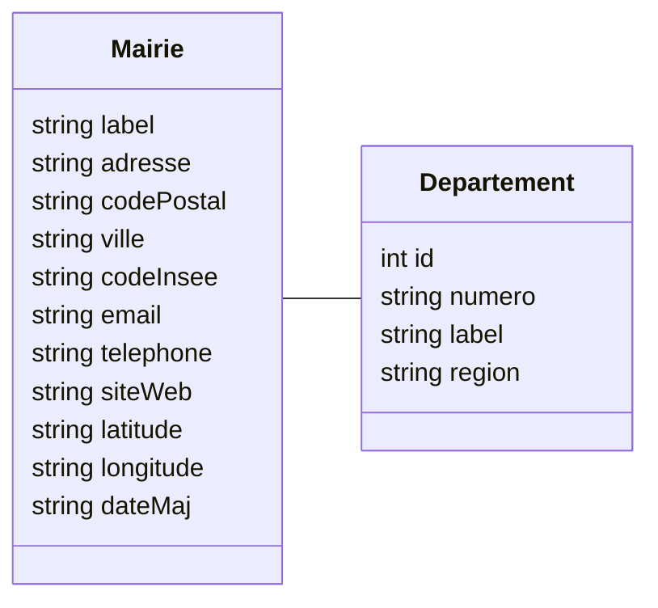

# Examen Module API - Communes de France et services associés

## Description

Vous êtes missionné par les services du ministère de l'intérieur pour créer une API permettant de mettre à disposition
des informations sur les communes de France et délivrer des outils supplémentaires à destination des particuliers ou entreprises.
Ces informations seront utilisées par les futures applications mobiles et des sites web, et l'api devra être capable de répondre aux cas d'utilisations suivants :

#### Partie Mairies
- Fournir une liste synthétique des communes de France permettant leurs géolocations sur une carte
  - Cette liste devra être filtrable par région, département, code postal, ville
  - Cette liste devra être ordonnable par nom de commune, code postal
- Fournir les informations détaillées d'une commune
- Fournir une liste des départements
  - Cette liste devra être filtrable par région, nom de département, numéro de département
  - Cette liste devra être ordonnable par nom de département, numéro de département
- Permettre d'ajouter une commune
- Permettre de supprimer une commune

#### Partie Services

- Fournir un service permettant de donner une estimation du montant de la taxe foncière
  - ce montant est obtenu en multipliant **la valeur cadastrale** de l'habitation par un taux de 0,5%
  - **la valeur cadastrale** est obtenue en multipliant la surface habitable de l'habitation par un prix au mètre carré
- Fournir un service permettant de donner une estimation du montant de la taxe d'enlèvement des ordures ménagères
  - ce montant est obtenu en mutlipliant la moitié de la **valeur locative cadastrale** de l'habitation par un taux de 9,37%
  - **la valeur locative cadastrale** représente le loyer annuel potentiel de la propriété si elle était mise en location.

### Fonctionnalités supplémentaires (facultatives)
- Permettre l'authentification des utilisateurs
- Autoriser l'ajout une commune seulement à un utilisateur est authentifié
- Autoriser la suppression une commune seulement à un utilisateur est authentifié

## Schéma relationnel

## Installation et démarrage de l'application
- Création du fichier d'environnement
    - `Dans le dossier /project Copier le fichier .env.example et le renommer en .env`
- Démarrage des services
    - `docker compose up -d`
- Connexion au container api
    - `docker exec -it api /bin/bash`
- Installation des dépendances
    - `composer install`
- Migration de la base de données
    - `symfony console d:m:m`

## Commandes d'imports des datas

- Import et départements
    - `symfony console import:departements`
- Import des mairies
    - `symfony console import:mairies` 

## Liens utiles
- [Documentation Symfony](https://symfony.com/doc/current/index.html)
- [Documentation API Platform](https://api-platform.com/docs/core/)